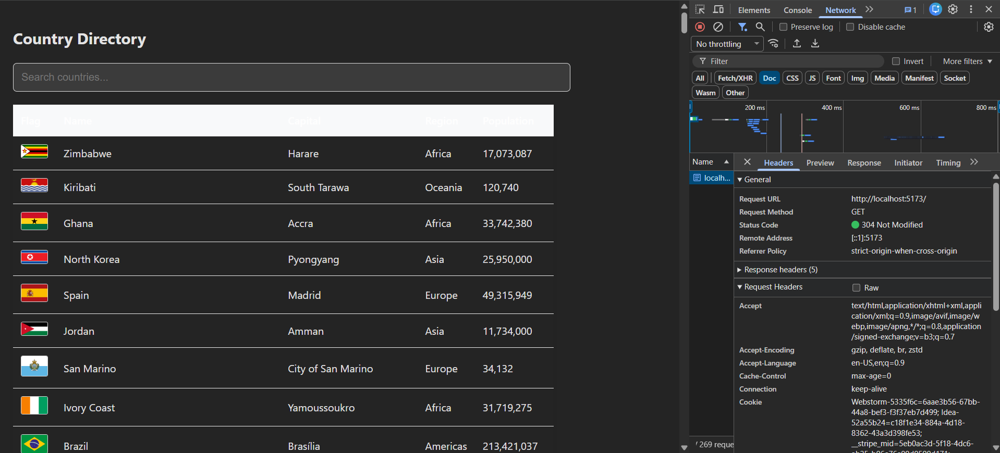

# Sentura Technologies - Internship Practical Test 2026

## 📌 Project Overview
A Full-Stack Country Information System built within a **40-minute time limit** for the Sentura Technologies internship technical assessment.

The system features a **Spring Boot** backend that fetches data from the RestCountries API with integrated caching, and a **React (TypeScript)** frontend for data visualization.

---

## 🚀 Key Technical Features

### 1. Backend (Java - Spring Boot)
* **External API Integration**: Successfully connects to `restcountries.com`.
* **Data Optimization**: Implemented strict field filtering to return only: `Name`, `Capital`, `Region`, `Population`, and `Flag`.
* **10-Minute In-Memory Cache**: To prevent redundant API calls and optimize performance, the system refreshes data only after a 10-minute window or upon initial load.
* **CORS Configuration**: Securely enabled for communication with the Vite frontend.

### 2. Frontend (React + TypeScript + Vite)
* **Type-Safe Components**: Used TypeScript interfaces for robust data handling.
* [cite_start]**Real-time Search**: Instant filtering of the country table via user input.
* [cite_start]**Interactive Modal**: Detailed view popup triggered by clicking any row in the table.
* **Custom Styling**: Clean, responsive UI built with custom CSS.

---

## 🛠️ Tech Stack
* **Frontend**: React 18, TypeScript, Vite
* **Backend**: Java 17, Spring Boot 3.x, Maven
* [cite_start]**API**: [RestCountries API](https://restcountries.com/)

---

## 🏃 How to Run

### Backend
1. Navigate to the `backend` folder.
2. Run `./mvnw spring-boot:run` or use your IDE.
3. Access at: `http://localhost:8080`

### Frontend
1. Navigate to the `frontend` folder.
2. Run `npm install` then `npm run dev`.
3. Access at: `http://localhost:5173`

---

## 📝 Performance Notes
- **Completion Time**: Successfully developed and documented within the allocated **40-minute** window.
- **Industry Practices**: Followed Conventional Commits, Constructor Injection in Spring, and Modular Component Design in React.